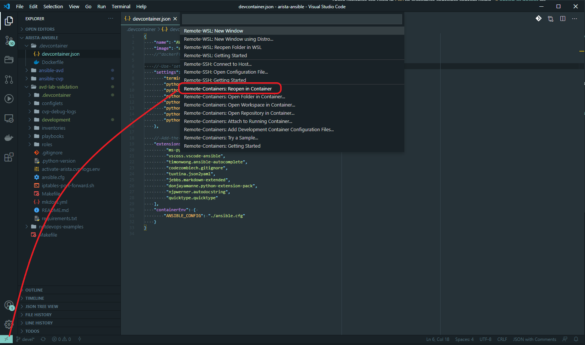

# How to use AVD image with VSCODE

## About

This how-to explains how to leverage __avdteam/base__ image as shell under [VScode](https://code.visualstudio.com/) to get a consistent developement and testing environment regardless operating system running Ansible. This how-to is applicable to any OS where VScode can be installed.

## Devcontainer with docker image

### Requirements

- [VScode](https://code.visualstudio.com/) installed on your system.
- Docker installed and running.
- GIT installed and configured.

For windows user, [WSL](https://docs.microsoft.com/en-us/windows/wsl/install-win10) should be configured on your system

### Configure AVD environment

Before running all code with a container, we have to download current AVD ecosystem with the following command:

- On Linux or Macos:

```shell
$ sh -c "$(curl -fsSL https://raw.githubusercontent.com/aristanetworks/ansible-avd/devel/development/install.sh)"
```

- On Windows:

```shell
PS C:\Users\User> Invoke-WebRequest -OutFile install.sh -Uri https://raw.githubusercontent.com/aristanetworks/ansible-avd/devel/development/install.sh

PS C:\Users\User> bash install.sh
```

This script git clone AVD and CVP collection as well as example repository to get started with example.

```shell
$ cd ansible-arista

$ ls -al
total 24
-rw-rw-r--  1 tom tom 2517 Jul 20 09:09 Makefile
drwxrwxr-x  8 tom tom 4096 Jul 20 09:09 ansible-avd
drwxrwxr-x  8 tom tom 4096 Jul 20 09:09 ansible-avd-cloudvision-demo
drwxrwxr-x  9 tom tom 4096 Jul 20 09:09 ansible-cvp
```

### Configure devcontainer

VScode provides a function to open a workspace in either remote ssh server, in a WSL instance (for windows only) or [in a container](https://code.visualstudio.com/docs/remote/containers). In this how-to, we will leverage this functionality with [__`avdteam/base`__](https://hub.docker.com/repository/docker/avdteam/base)

- On Linux or Macos:

```shell
$ pwd 
/home/tom/arista-ansible

# create VScode folder
$ mkdir .devcontainer

# edit configuration
$ vim .devcontainer/devcontainer.json
```

Copy following content to `devcontainer.json`:

```json
{
    "name": "AVD development",
    "image": "avdteam/base:3.6",
    //"dockerFile": "Dockerfile",

    // Use 'settings' to set *default* container specific settings.json values on container create. 
    "settings": {
        "terminal.integrated.shell.linux": "/bin/zsh",
        "python.linting.enabled": true,
        "python.linting.pylintEnabled": true,
        "python.linting.flake8Path": "/root/.local/bin/flake8",
        "python.linting.pycodestylePath": "/usr/local/py-utils/bin/pycodestyle",
        "python.linting.pydocstylePath": "/usr/local/py-utils/bin/pydocstyle",
        "python.linting.pylintPath": "/root/.local/bin/pylint",
        "python.testing.pytestPath": "/root/.local/bin/pytest"
    },

    // Add the IDs of extensions you want installed when the container is created in the array below.
    "extensions": [
         "ms-python.python",
         "vscoss.vscode-ansible",
         "timonwong.ansible-autocomplete",
         "codezombiech.gitignore",
         "tuxtina.json2yaml",
         "jebbs.markdown-extended",
         "donjayamanne.python-extension-pack",
         "njpwerner.autodocstring",
         "quicktype.quicktype"
    ],
    "containerEnv": { 
        "ANSIBLE_CONFIG": "./ansible.cfg"
    }
}
```

### Open content in container

After you configured `.devcontainer/devcontainer.json` correctly, you can open VScode and start local container with following actions:



